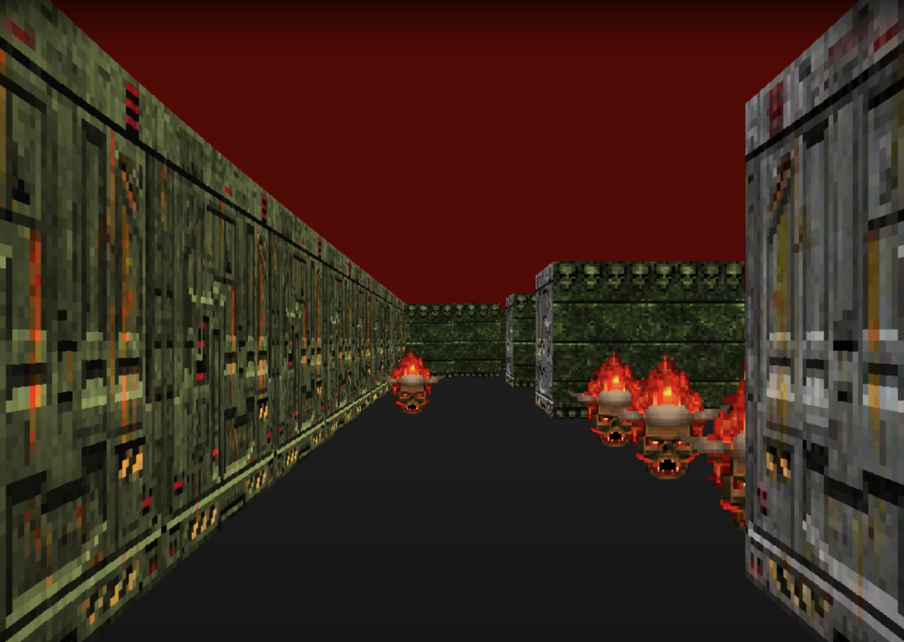

# cub3D

My first RayCaster with miniLibX

### Screen/Video

[](http://www.youtube.com/watch?v=JjhiBYCqvQs "Doom Cub3D")

## Summary

This project is inspired by the world-famous eponymous 90’s game, which was the first FPS ever. It will enable you to explore ray-casting. Your goal will be to make a dynamic view inside a maze, in which you’ll have to find your way.

```

The constraints are as follows:
• You must use the miniLibX. Either the version that is available on the operating system, or from its sources. If you choose to work with the sources, you will need to apply the same rules for your libft as those written above in Common Instructions part.
• The management of your window must remain smooth: changing to another win- dow, minimizing, etc.
• Display different wall textures (the choice is yours) that vary depending on which side the wall is facing (North, South, East, West).
• Your program must be able to display an item (sprite) instead of a wall.
• Your program must be able to set the floor and ceilling colors to two different ones.
• In case the Deepthought has eyes one day to evaluate your project, your program must save the first rendered image in bmp format when its second argument is "––save".
• If no second argument is supllied, the program displays the image in a window and respects the following rules:
◦ The left and right arrow keys of the keyboard must allow you to look left and right in the maze.
◦ The W, A, S and D keys must allow you to move the point of view through the maze.
◦ Pressing ESC must close the window and quit the program cleanly.
◦ Clicking on the red cross on the window’s frame must close the window and
quit the program cleanly.
◦ If the declared screen size in the map is greater than the display resolution, the window size will be set depending to the current display resolution.
◦ The use of images of the minilibX is strongly recommended.
• Your program must take as a first argument a scene description file with the .cub
extension.
◦ The map must be composed of only 4 possible characters: 0 for an empty space, 1 for a wall, 2 for an item and N,S,E or W for the player’s start position and spawning orientation.
This is a simple valid map:
111111
100101
102001
1100N1
111111
◦ The map must be closed/surrounded by walls, if not the program must return an error.
◦ Except for the map content, each type of element can be separated by one or more empty line(s).
◦ Except for the map content which always has to be the last, each type of element can be set in any order in the file.
◦ Except for the map, each type of information from an element can be separated by one or more space(s).
◦ The map must be parsed as it looks like in the file. Spaces are a valid part of the map, and is up to you to handle. You must be able to parse any kind of map, as long as it respects the maps rules.
◦ Each element (except the map) firsts information is the type identifier (com- posed by one or two character(s)), followed by all specific informations for each object in a strict order such as :
∗ Resolution:
R 1920 1080
· identifier: R · x render size · y render size
∗ North texture:
         NO ./path_to_the_north_texture
· identifier: NO
· path to the north texure ∗ South texture:
         SO ./path_to_the_south_texture
· identifier: SO
· path to the south texure ∗ West texture:
         WE ./path_to_the_west_texture
· identifier: WE
· path to the west texure ∗ East texture:
         EA ./path_to_the_east_texture
· identifier: EA
· path to the east texure ∗ Sprite texture:
         S ./path_to_the_sprite_texture
· identifier: S
· path to the sprite texure ∗ Floor color:
F 220,100,0
· identifier: F
· R,G,B colors in range [0,255]: 0, 255, 255
∗ Ceilling color:
C 225,30,0
· identifier: C
· R,G,B colors in range [0,255]: 0, 255, 255
◦ Example of the mandatory part with a minimalist .cub scene:
R 1920 1080
NO ./path_to_the_north_texture
SO ./path_to_the_south_texture
WE ./path_to_the_west_texture
EA ./path_to_the_east_texture
S ./path_to_the_sprite_texture
F 220,100,0
C 225,30,0
1111111111111111111111111
1000000000110000000000001
1011000001110000002000001
1001000000000000000000001
111111111011000001110000000000001
100000000011000001110111111111111
11110111111111011100000010001
11110111111111011101010010001
11000000110101011100000010001
10002000000000001100000010001
10000000000000001101010010001
11000001110101011111011110N0111
11110111 1110101 101111010001 11111111 1111111 111111111111
◦ If any misconfiguration of any kind is encountered in the file, the program must exit properly and return "Error\n" followed by an explicit error message of your choice.

```

## Install

```bash
make
```

## Start

```bash
./cub3D maps/doom.cub
```


## Reviews

```bash
success 100/100
```
